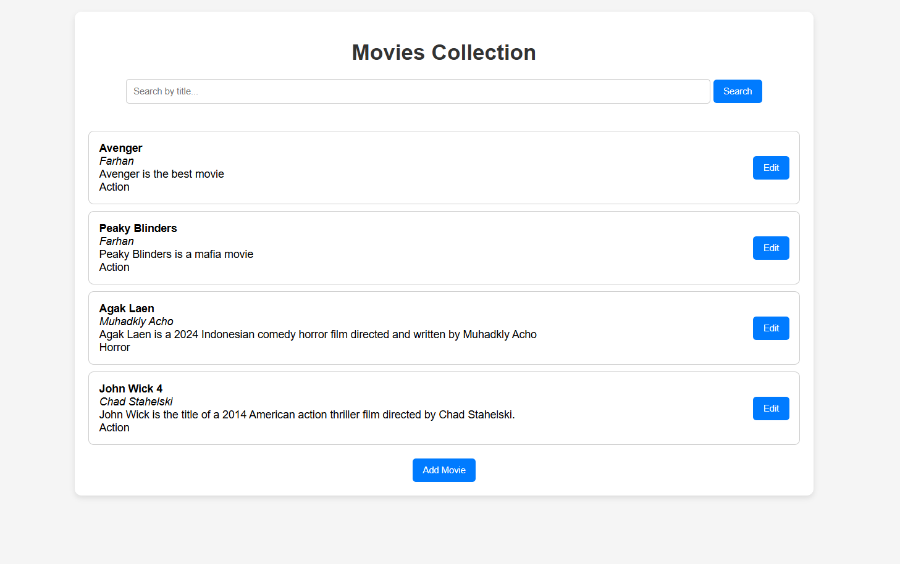
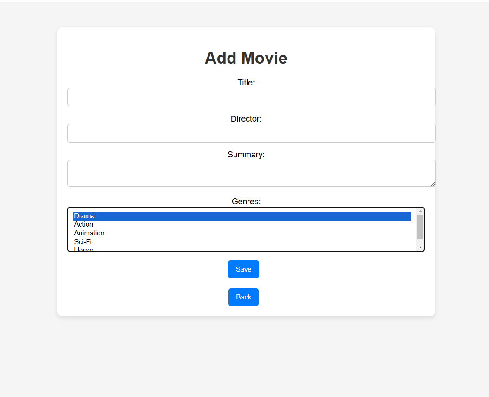

# Movie CRUD App

This is a simple CRUD application to manage a movie collection using Java Spring Boot and Thymeleaf.

## Features
- Add, Edit, Delete movies
- Search movies by title
- Pop-up notifications for actions (add, edit, delete, not found)
- Validation for form inputs

## Screenshots

### Main UI


### Add Movie


### Edit Movie


## How to Run
1. Clone this repository:
   ```bash
   git clone https://github.com/your-username/movie-crud-app.git
   cd movie-crud-app
2. Build and run the application:
   ```bash
   ./mvnw spring-boot:run
3. Open the application in your browser at http://localhost:8080

## Requirements
- Java 17+
- Spring Boot 3+
- Thymeleaf
- PostgreSQL

## Author
Farhan Akhmad Fahrezi